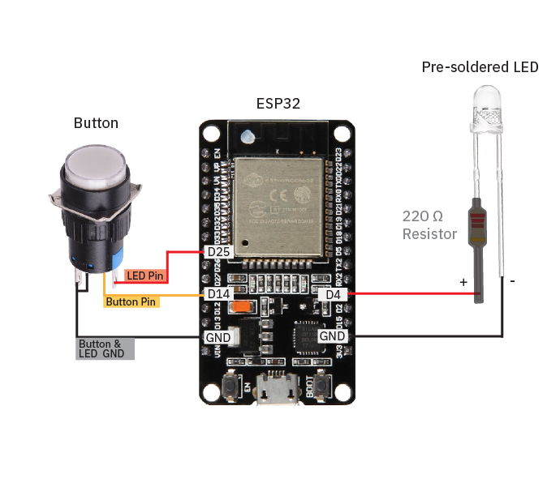

# NYC Resistor Workshop: Build Your Own IoT Love Messengers!
**Saturday, Dec 21, 2024** 
 
by Julia Daser and Pepi Ng
 

## This Github Page Contains
1. [**3D models**](https://github.com/pepzicles/NYCResistor_LoveMessengers/tree/main/3D%20Models) of the box encasing, the floor, and the hearts for 3D-printing
2. The [**Code**](https://github.com/pepzicles/NYCResistor_LoveMessengers/blob/main/code.ino) for the ESP32 Microcontrollers
3. The [**Class-Slides**](https://docs.google.com/presentation/d/1tKyRhq-H0f7qh0r20IBgMoWx7r3AGBdcS3LCC1Dzuw8/edit?usp=sharing)
4. The Slides on [**How to Create a Database**](https://docs.google.com/presentation/d/1zPSLw4Wz-GZKNYMVfDDKSwGD7ciGzl55iZsEPTTHffk/edit#slide=id.g2ef87a7d5d3_0_0)
5. The Slides on [**How to Upload the ESP32 Code**](https://docs.google.com/presentation/d/1itNOjG2VIbihmtBbmWOF_zTDMhbYNMa45zIEW7B6CLA/edit#slide=id.g2ef87a7d5d3_0_0)

 

## You attended our  workshop and want to use the Love Messengers at home?
To use the *Love Messengers* at home, you need to re-upload the code with your own WiFi name and Password. 
Follow our PDF-instructions if you need a reminder on how to do so: [PDF Instructions](ADD URL HERE)
 
 
You can keep using the same Database we created in the workshop. (If you want to create a new Database, or you have not created one yet, follow [this tutorial](https://docs.google.com/presentation/d/1zPSLw4Wz-GZKNYMVfDDKSwGD7ciGzl55iZsEPTTHffk/edit#slide=id.g2ef87a7d5d3_0_0).

 

## Contact us
We hope you guys had tons of fun building  DIY Love Messengers 💙🧡   
If you run into any issues, please reach out to us!! We would love to help
 
#### Email:  yiqing.ng@gmail.com
#### Instagram: [@julia.daser](https://www.instagram.com/julia.daser/)
#### Youtube: [@WormiCollective](https://www.youtube.com/@WormiCollective)

 

## About 
Our DIY Love Messengers are the perfect gift for your friends/ partners, especially long-distance ones! When the button of one love messenger is pressed, both of them will light up - no matter HOW FAR AWAY the two messengers are! We will be using all the files, code and 3D models from this repository.
 
 

 
 

## Materials needed to build two Love Messengers
1. 4x 3D-printed translucent heart OR star **halves** (see '3D models' folder)
2. 2x 3D-printed box encasings (see '3D models' folder)
3. 2x 3D-printed box floors (see '3D models' folder)
4. 2x [16mm pre-soldered illuminated push buttons](https://www.amazon.com/Momentary-Button-Switch-Assorted-Self-Resetting/dp/B08SKJ6V7Z/ref=sr_1_1?crid=15XOB0NRJVYZG&dib=eyJ2IjoiMSJ9.PTzmlQJHXCpsQiIXbfo2Ov7rp4bECht4jtlXfVZvVF4zkDjQC1R5EnoC9CGBjdkIB8J_rHjL7T8jlvaU4CCXU7tHXp7dsf89nej9O_FmVMKtd4ldOqNndH6IulD7bgYFrYzcfdaVbhZ1wUJJtOhbbChOjoa72QO27-dQTqGAObebMQAa7FidL9kFa_tBrL1PcvtsSmWucIAfWC7JDp0ybONBo5yFBttW4TJTIl_vztc.DKsbjW50WAkPjotY_1SKpv2pYsfXtzALqJ4iV3Mo1-g&dib_tag=se&keywords=push+buttons&qid=1722468088&sprefix=pushbuttons%2Caps%2C274&sr=8-1) ($0.62 per)
5. 2x [pre-soldered Super bright LEDs](https://www.amazon.com/dp/B01AUI4VQU/ref=sspa_dk_detail_4?pd_rd_i=B01AUI4VQU&pd_rd_w=YnDHQ&content-id=amzn1.sym.248b5e31-60e8-4934-96cf-b3789198461a&pf_rd_p=248b5e31-60e8-4934-96cf-b3789198461a&pf_rd_r=0NJCFTT68WD09JGSG2HB&pd_rd_wg=p8EFN&pd_rd_r=797c86d4-d6a1-4a3a-b51a-dba9e538c45a&s=hi&sp_csd=d2lkZ2V0TmFtZT1zcF9kZXRhaWxfdGhlbWF0aWM&th=1) (Pre-soldered with resistors) ($5.99 for 100)
6. 4x [M2.5 x 10 mm Screws](https://www.amazon.com/uxcell-100pcs-Stainless-Phillips-Tapping/dp/B01KXTUCM8/ref=sr_1_1_sspa?crid=1A0H7ME44I8XG&dib=eyJ2IjoiMSJ9.1EDcmIzZvaAscU3Q-1ZO17pntsZAfotkye6Xwgxa5MQWk30NrBFC_MF6IROeWOjLtfmwox328E3DkG8CdnVfezLs6Xb8RNRxMYqVslyaOu7hm3xB4WrDxBira7h0NvUAXxpph7wWM13UlfpV83F09FYsV4QALO0P2KET0VfsBjRP6IfLUAXQQszT4pUiwVfxoMEFR5iH1uEIA9eKS5eNCjoAmmfHzkeT9CZx5lyap4k.YbI_gbR8JlB_4itWpd1EIFg7ybsKn-BVILFg5GIqTQk&dib_tag=se&keywords=m2%2Bx%2B8mm%2Bscrews&qid=1716141059&sprefix=M2%2Bx%2B8mm%2B%2Caps%2C109&sr=8-1-spons&sp_csd=d2lkZ2V0TmFtZT1zcF9hdGY&th=1)
7. 2x [ESP32-WROOM-32 microcontrollers, unassembled. We used ones with USBC ports.](https://www.amazon.com/dp/B0B18NK2MS?ref=ppx_yo2ov_dt_b_fed_asin_title&th=1) ($5.40 per)
8. 2x [USBC wires](https://www.amazon.com/dp/B0CFQ5T5F6?ref=ppx_yo2ov_dt_b_fed_asin_title) (To upload code to microcontrollers, your USB wire needs to be able to both *charge* and *transmit data*.)

    
 

## Wire Diagram: 

    
 

## Other Tools/ Equipment: 
1. Pliers
2. Wire Stripper
3. Small Screwdrivers
4. Soldering Kit

 
 
