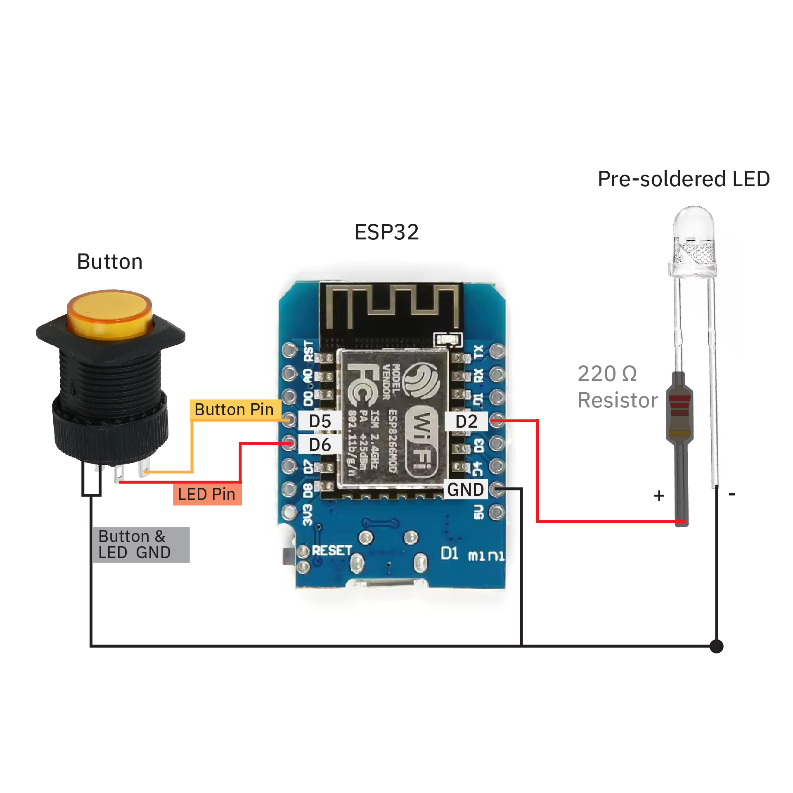

# February 2025 Edition of NYC Resistor Workshop!
**Sunday, Feb 9th and 14th, 2025** 
## About 
Our DIY Love Messengers are the perfect gift for your friends/ partners, especially long-distance ones! When the button of one love messenger is pressed, both of them will light up - no matter HOW FAR AWAY the two messengers are! We will be using all the files, code and 3D models from this repository.
 
 

 
 
 
by Julia Daser and Pepi Ng
 
 
Thank you Aiyo Cheboi for your help in prep work 💖
Thank you Grace Park for the graphic design 💖
 

## This Github Page Contains
1. [**3D models**](./3D%20Models) of the box encasing, the floor, and the hearts for 3D-printing
2. The [**Code**](./code.ino) for the ESP8266 Microcontrollers
3. The [**Class-Slides**](https://docs.google.com/presentation/d/1ocXh6diw_edAS3Q-rFSFNbqER26dfUnC6ZojbTQyBRY/edit?usp=sharing)
4. The Slides on [**How to Create a Database**](https://docs.google.com/presentation/d/1a_2duaqs7iLQxJ0YRQL2W0tEB2cOFd3lxEb4I4ITkuo/edit?usp=sharing)
5. The Slides on [**How to Upload the ESP8266 Code**](https://docs.google.com/presentation/d/1LtjJ1A2UF-neDaa2aErODWTvgGm7FnszxuaijPIQiqY/edit?usp=sharing)

 

## You attended our  workshop and want to use the Love Messengers at home?
To use the *Love Messengers* at home, you need to re-upload the code with your own WiFi name and Password. 
Follow our instructions if you need a reminder on how to do so: [Instructions](https://docs.google.com/presentation/d/1LtjJ1A2UF-neDaa2aErODWTvgGm7FnszxuaijPIQiqY/edit?usp=sharing)
 
 
You can keep using the same Database we created in the workshop. (If you want to create a new Database, or you have not created one yet, follow [this tutorial](https://docs.google.com/presentation/d/1a_2duaqs7iLQxJ0YRQL2W0tEB2cOFd3lxEb4I4ITkuo/edit?usp=sharing).

 

## Contact us
We hope you guys had tons of fun building  DIY Love Messengers 💙🧡   
If you run into any issues, please reach out to us!! We would love to help
 
#### Email:  yiqing.ng@gmail.com
#### Instagram: [@julia.daser](https://www.instagram.com/julia.daser/)
#### Youtube: [@WormiCollective](https://www.youtube.com/@WormiCollective)

 
 

## Materials needed to build two Love Messengers
1. 4x 3D-printed translucent heart **halves** (see '3D models' folder)
2. 2x 3D-printed box encasings (see '3D models' folder)
3. 2x 3D-printed box floors (see '3D models' folder)
4. 2x [16mm pre-soldered illuminated push buttons](https://www.aliexpress.us/item/3256807351535133.html?spm=a2g0o.productlist.main.1.13e3dwapdwapWZ&algo_pvid=28c7de6e-6987-4dd0-89d9-ce90df18d17b&algo_exp_id=28c7de6e-6987-4dd0-89d9-ce90df18d17b-0&pdp_npi=4%40dis%21USD%210.90%210.90%21%21%210.90%210.90%21%40212e532617364751561131231e6170%2112000041204618280%21sea%21US%216005403218%21X&curPageLogUid=uw0WbmUFIhEi&utparam-url=scene%3Asearch%7Cquery_from%3A) (Make sure to purchase 'momentary' and '4-pin' option) ($0.90 per)
5. 2x [pre-soldered LEDs](https://www.amazon.com/Assorted-Transparent-Warm-White-Emitting-Assortment/dp/B08G4VKN1W/ref=pd_lpo_d_sccl_3/140-4372576-9242925?pd_rd_w=2Q003&content-id=amzn1.sym.4c8c52db-06f8-4e42-8e56-912796f2ea6c&pf_rd_p=4c8c52db-06f8-4e42-8e56-912796f2ea6c&pf_rd_r=Y6T4G8EHERS44HJHPMPS&pd_rd_wg=BDLNO&pd_rd_r=334fb2ee-2563-41d5-81b0-6a5eee7d38ce&pd_rd_i=B08G4X23BR&th=1) (Pre-soldered with resistors, different colors are available and all function the same) ($0.35 per)
6. 4x [M2.5 x 10 mm Screws](https://www.amazon.com/uxcell-100pcs-Stainless-Phillips-Tapping/dp/B01KXTUCM8/ref=sr_1_1_sspa?crid=1A0H7ME44I8XG&dib=eyJ2IjoiMSJ9.1EDcmIzZvaAscU3Q-1ZO17pntsZAfotkye6Xwgxa5MQWk30NrBFC_MF6IROeWOjLtfmwox328E3DkG8CdnVfezLs6Xb8RNRxMYqVslyaOu7hm3xB4WrDxBira7h0NvUAXxpph7wWM13UlfpV83F09FYsV4QALO0P2KET0VfsBjRP6IfLUAXQQszT4pUiwVfxoMEFR5iH1uEIA9eKS5eNCjoAmmfHzkeT9CZx5lyap4k.YbI_gbR8JlB_4itWpd1EIFg7ybsKn-BVILFg5GIqTQk&dib_tag=se&keywords=m2%2Bx%2B8mm%2Bscrews&qid=1716141059&sprefix=M2%2Bx%2B8mm%2B%2Caps%2C109&sr=8-1-spons&sp_csd=d2lkZ2V0TmFtZT1zcF9hdGY&th=1)
7. 2x [ESP32-WROOM-32 microcontrollers, unassembled.](https://www.amazon.com/dp/B0BHW1CNCM?smid=A2Z10KY0342329&ref_=chk_typ_imgToDp&th=1) (We used ones with USBC ports.) ($3.30 per)
8. 2x [USBC wires](https://www.amazon.com/dp/B0CFQ5T5F6?ref=ppx_yo2ov_dt_b_fed_asin_title&th=1) (To upload code to microcontrollers, your USB wire needs to be able to both *charge* and *transmit data*.) ($2.00 per)

    
 

## Wire Diagram: 

    
 

## Other Tools/ Equipment: 
1. Pliers
2. Wire Stripper
3. Small Screwdrivers
4. Soldering Kit

 
 
